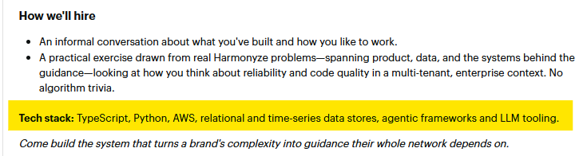
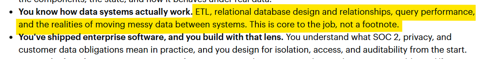

# harmonyze-senior-software-engineer-ai-agents

[](https://github.com/RichardLitt/standard-readme)
TODO: Put more badges here.

tech skill demo for Harmonyze software engineer position

TODO: Fill out this long description.

## Table of Contents

- [Security](#security)
- [Background](#background)
- [Install](#install)
- [Usage](#usage)
- [API](#api)
- [Maintainers](#maintainers)
- [Contributing](#contributing)
- [License](#license)

## Security

## Background



### Showcase qualifications

(Greenspan, Senior Software Engineer, _What We're looking for_).


### Deployable Assets


## Install

```sh
```

## Usage


### Database Usage

This application uses Knex to manage and scale its SQL database. See its [official documentation](https://knexjs.org/guide/) for full usage details
#### 


Database schemas are scaled using [knex migrations](https://knexjs.org/guide/migrations.html) through its Command-Line-Interface

```
knex migrate:make {your_file_name}
```


```sh
```

## API

## Maintainers

[@Nick Montana](https://github.com/Nick Montana)

## Contributing


Small note: If editing the README, please conform to the
[standard-readme](https://github.com/RichardLitt/standard-readme) specification.

## License

MIT © 2026 Nick Montana
